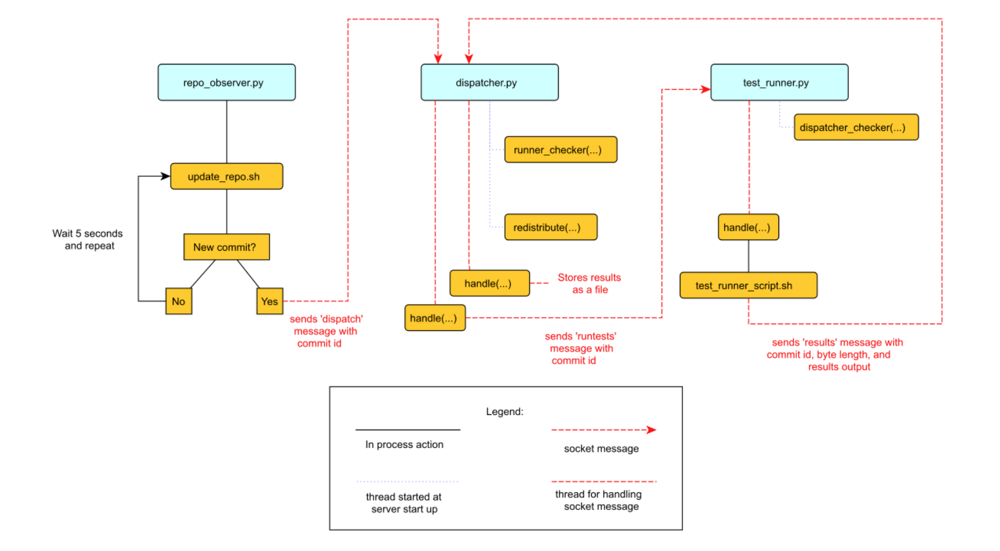

# What is a Continuous Integration System?

The continuous integration (CI) systems are dedicated systems used to test new codes.
- Upon a commit to the repository, the system will test all the codes won't break any test.
- The system will fetch the changes, run the tests and report its results.
- The system is failure resistant.
- The system should be able to run the test in parallel so developers can achieve the results of the tests in a reasonable amount of time.

# Project Limitations and Notes

The project
- Uses `Git` as the version control repository
- Only run tests that are in the directory named `tests` within the repository
- Use local repository instead of web server
- CI runs periodically in the example. Actually CI can run per commit base.
- This system gathers the result and save them in files in the file system local to the dispatcher process

# Introduction

The basic structure of a CI system consists three components:
- An observer: watches the repository and notifies the job dispatchers there is a new commit
- A test job dispatcher: finds a test runner and give it the commit number to test
- A test runner: run the test

There are many possible architectures for the CI system
- All three components can be on the same machine, but it
    - has no load handling, and the capacity is limited (not load-bearing)
    - if the machine is down, no tests will be run (not failt-tolarent)
- Each components will be run on different process
- They communicate via sockets, so they can be run on different network machines

With this architecture, all three components are run on different machine. So if any of the components are down, we can schedule a new machine, and run the buffered tasks after the new machine is up. It also allows us run multiple tests in parallel. (Distributed system? I reckon this does not require too many locks, as we generally don't have data race.)

The project does **not** have auto-recovery code as it is independent on the distributed system's architecture.

## Files in this Project

In this project, we have one Python file for each component:
- the repository observer `repo_observer.py`
- the test job dispatcher `dispatcher.py`
- the test runner `test_runner.py`
- the communicator `helper.py`

Each of these three processes communicate with each other using sockets using `helper.py`.

There are also bash scripts to help python to run system level of jobs instead of using `os` and `subprocess`.

Lastly, there is a tests directory containing all the tests.

# The Components

## The Repository Observer (`repo_observer.py`)

The task of repository observer monitors a repository and notifies the dispatcher when a new commit is seen. In order to work with all version control systems (not all VCs have built-in notification system), this repository observer is writte to periodically check the repository for new commits instead of relying on the VCs to notify it that changes have been made.

The observer will poll the repo periodically, and when a change is seen, it will tell the dispatcher the newest commit ID to run tests against.

For the purposes of this example, the observer will only dispatch tests against the latest commit.

The observer must know which repository to observe. We previously created a clone of our repository at `/path/to/tset_repo_clone_obs`. The observer will use the clone to detect chagnes.The repo observer will use this clone to pull from the main repository.

We run the `repo_observer.py` program to constantly (every 5s) observe the git repo
- It run `update_repo.sh` to grep the commit id of newest commitment.
- If a new commit is seen, a file `.commit_id` will be created containing the newest commit id.
- If it sees a new commit, it tells the dispatcher host the corresponding commit id.
- After everything has been done, it sleeps for 5 seconds and run itself again.

The step by step breakdown of `update_repo.sh` and `repo_observer.py` are included in the files.

__NOTE:__ We need to know the server ip and port of another machine. If we know the name of the machine, we can use `ping MACHINE_NAME` to get the ip address. _I don't know the way to find the port. Maybe always 8888?_

## The Dispatcher (`dispatcher.py`)

The dispatcher is a service used to delegate testing tasks. Looks like it's the central server controls and distribute tasks.
- It listens on a port for requests from test runners and from the repository observer.
- It allows test runners to register themselves
- When given a commit id from repo observer, it will dispatch a test runner against the new commit.
- It observes problems from test runner and redistribute a new test runner for the commit id if some problem occurs.

The detailed line by line explanation of `dispatch.py` is in the file.

## The Test Runner (`test_runner.py`)

The test runner is responsible for running tests against a given commit ID and reporting the result to the dispatcher. It communicates with only dispatcher.

When the `test_runner.py` file is invoked,
- it calls the `serve` function which starts the test runner server
- it also starts a thread to run the `dispatcher_checker` function

The start up method is similar as `dispatcher.py`, we omit the code here. Write down your version then.

## Error Handling

This CI system has very simple error handling.

- Dispatcher will notice the runner was failed and disconnect it from its list.
- Dispatcher will notice the runner working with some task fails and redistribute the task to some other free runner.
- Repository observer will notice the dispatcher down and throw an exception. The runners will notice it and shut down automatically.

## Conclusion

- Here we separate the concerns into different processes and build a simple distributed continuous integration system.
- Via communication through sockets, we can distribute different components into different machines.

We are possible to extend the CI system. Here are a few possibilities.

### Per-commit test runs

### Smarter Test Runners

Now test runners stop when it detects the dispatcher fails and stop itself even during a task. But it will be useful if the test runners wait for a certain amount of the time so the dispatcher has a chance to come back.

Or, test runners can finish the job, logs the test results, and wait for the dispatchers to come back and send the results afterwards.

### Real Reporting

# Take away from this post

Here I feel like I have learnt something:

- Multithreading and distributed system communicated via sockets. Looks like understanding this part will be helpful in the future, and using Python we should be able to make these happen without tooooo much efforts.
- A lot of work can be done via logging to a hidden file or directory (add a `.` at the beginning of the filename or dirname). It has been done all over the place, like bash config file, vim config file, vim/zsh plugin management folder. Why should not we do the same thing?
